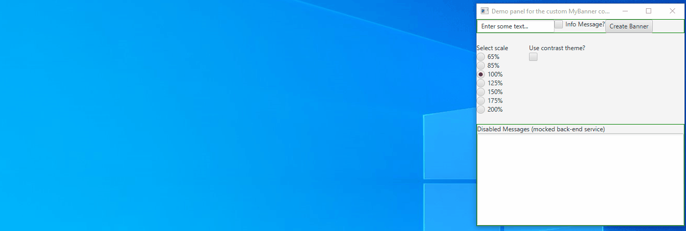
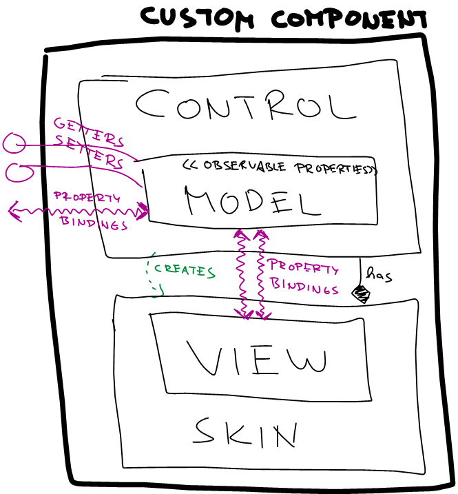

# Coding Challenge - JavaFX Custom Banner
This is a one-day coding challenge that I developed on 21.6.2021. See the assignment below.
Before starting, I looked up information and best practices on the internet. The most inspiring for me was this video by Jonathan Giles

https://www.youtube.com/watch?v=L9xtOhdSx6k

In this video, Jonathan explains three ways to create custom components.
1) extend from an existing component
2) extend from Layout Container
3) extend from Control

The option of drawing components on canvas is not explained in the video. But this one wouldn't be suitable for the task anyway.

I chose option 3. extend from Control (with behavioral skin), which is the most generic and gives full control over the component's behavior 

## Assignment
Create a custom banner whose interface supports these features:
* optional toggle between banner type: success/info
* entering the text of the message
* checkbox: subscribe/unsubscribe to this message
* scalability 65%, 85%, 100%, 125% 150% 175% 200%
* switching to contrast mode for easy reading

## Demo

## MVC concept in nuthell

## How to run
* Prerequisities - Java 11+
* `mvn javafx:run`